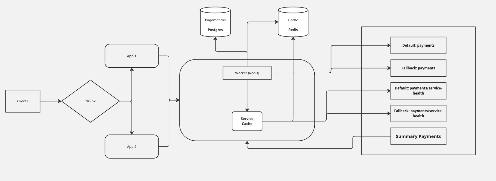

# Rinha de Backend 2025 - Payment Gateway

Backend para intermediar pagamentos com Payment Processor e Payment Fallback.

## Arquitetura

- Web Servers: 2 instâncias com load balancer Nginx
- Docker Compose com limites: 1,5 CPU total, 350MB memória total
- Banco PostgreSQL para persistência
- Redis para cache

Projeto consiste em uma aplicação FastAPI que recebe solicitações de pagamento e os envia para um processador.
Esse processador disponibiliza um endpoint para informar qual o status dos processadores (default e fallback), para tal,
existe um serviço de cache que fica atualizado com as informações do processador. A api /payments dispobilizada pelo backend, 
envia as solicitações para um worker (P2P com redis) que consulta no redis qual o processador disponivel e envia a
solicitação para ele, em caso de sucesso, salva o pagamento no banco de dados (postgres).



## Endpoints

- `POST /payments`: intermedia pagamento
- `GET /payments-summary`: resumo de pagamentos processados

## Tecnologias

- Python com FastAPI
- PostgreSQL
- Redis
- Docker Compose
- Nginx como load balancer
- Pydantic para validação
- SQLAlchemy para ORM

## Como executar

```bash
docker compose up --build
```

O serviço estará disponível em `http://localhost:9999`


